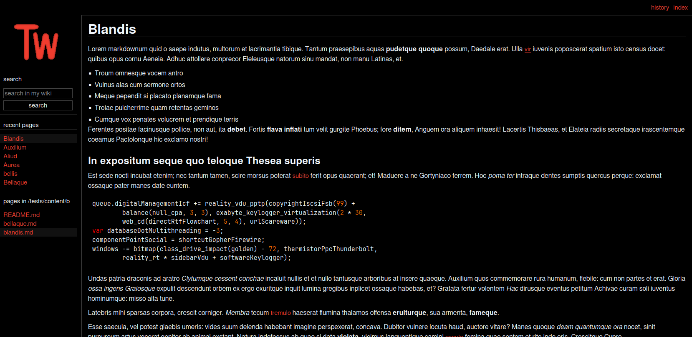

# teawiki | simple git based wiki


a simple HTTP web application that let's you create wikis using git and markdown



i created this program for my own wiki, so i specifically designed it around my
personal needs, however it's easily configurable, so feel free to use it if it
fulfills your needs as well

---

- [features](#features)
- [missing features (that other wikis usually have)](#missing-features-that-other-wikis-usually-have)
- [installation](#installation)
- [configuration](#configuration)
    - [webhook setup](#webhook-setup)
    - [custom themes](#custom-themes)
    - [custom assets](#custom-assets)
    - [writing wiki pages](#writing-wiki-pages)
        - [metadata](#metadata)
        - [content](#content)
        - [special pages](#special-pages)
- [development](#development)
    - [adding translations](#adding-translations)
    - [reporting issues](#reporting-issues)
    - [other contributions](#other-contributions)

---

## features
- free software (free as in freedom)
- simple and minimal web interface inspired by
[MediaWiki's MonoBook skin](https://www.mediawiki.org/wiki/Skin:MonoBook)
- configurable light and dark theme, you can also use custom themes
- YAML and markdown based article/page format (with code syntax highlighting)
- very simple, static [infobox](https://en.wikipedia.org/wiki/Infobox) support
(also inspired by MediaWiki)
- [gitea](https://about.gitea.com/) and github webhook support

## missing features (that other wikis usually have)
- no user account system
- no web-based editor/manager
- not easily extensible (no plugins, extensions etc.)

for me personally, the missing features listed above are not a problem, but it
might be a problem for you, in this case i suggest you look for an another
alternative (and there are
[plenty](https://awesome-selfhosted.net/tags/wikis.html) of alternatives)

and please do not create an issue telling me to add one these features listed
above, because i won't, or if you implement it yourself, don't create PR to
merge it, but other issues and PRs are welcome

## installation
best way to use teawiki is to use docker compose, this is the best and the
*intended* deployment option

an [example compose file](compose.example.yml) can be found in the repo, copy
this and modify it for your needs

i also suggest you use a reverse proxy server instead of directly exposing the
docker container to the internet, so you can configure stuff like SSL, CORS etc.

## configuration
all the configuration is environment variable based, here are all the options:

- `TW_LISTEN`: host the web server will listen on, default is `127.0.0.1:8080`

- `TW_NAME`: name of your wiki, displayed in the HTML titles and stuff, default
is `my wiki`

- `TW_DESC`: short description for your wiki, displayed in HTML meta elements,
default is `my personal wiki`

- `TW_KEYWORDS`: keywords for your wiki, will be included the in HTML meta
elements, split multiple words by comma, default is `wiki`

- `TW_SOURCE_URL`: URL for the web interface that is used to display git repo's
source code, for example if your wiki lives in
`https://github.com/example/wiki`, and uses the `main` branch, this URL should
be set to `https://github.com/example/wiki/tree/main`

- `TW_COMMIT_URL`: URL for the web interface that is used to display git repo's
commits, for example if your wiki lives in `https://github.com/example/wiki`,
this should be set to `https://github.com/example/wiki/commit`

- `TW_REPO_PATH`: path to the local git repo, by default it's `./source`

- `TW_REPO_URL`: URL for the remote git repo, if specified, repo will be
pulled/cloned to `TW_REPO_PATH`

- `TW_PULL_INTERVAL`: interval for pulling the repo from `TW_REPO_URL` to keep
everything synced with remote, by default it's set to `30m`, so thirty minutes,
you can use the `h`, `m` or `s` suffix to specify hours, minutes or seconds.
Also this not the ideal way to keep the repo synced with the remote, instead you
should setup a webhook the `TW_WEBHOOK_SOURCE` and `TW_WEBHOOK_SECRET`

- `TW_WEBHOOK_SOURCE`: source for the webhook, only the values `github` and
`gitea` is allowed for this option

- `TW_WEBHOOK_SECRET`: secret value for the webhook, this will displayed in
Github/Gitea interface when you create the webhook

- `TW_CHROMA_STYLE`: style for the
[chroma syntax highlighter](https://github.com/alecthomas/chroma), check out
[Chroma Style Gallery](https://xyproto.github.io/splash/docs/) to view the
available styles. By default it is set to `rrt`.

- `TW_THEME`: name of the color theme you want to use, `dark` and `light` themes
are available and `dark` is the default

- `TW_LANG`: language for the web application, `en` (English) and `tr` (Turkish)
are available, and `en` is the default

- `TW_TIME`: time format, this will be used display stuff like the commit times
etc. Default format is `02/01/06 15:04:05 GMT-07`, to create your own format
[see how time formatting is done in go](https://go.dev/src/time/format.go)

- `TW_LOGO`: name of the logo file, which is displayed in the sidebar of the web
interface, by default it's set to `logo.png`

- `TW_ICON`: name of the icon file, which is displayed as the browser tab icon,
by default it's set to `logo.png`

### webhook setup
using the github/gitea interface, create a **push** webhook for your wiki repo,
then set the URL to `http://[address for your wiki]/_/webhook`

after creating the webhook add the `TW_WEBHOOK_SOURCE` and `TW_WEBHOOK_SECRET`
environment options to your docker file as explained in the configuration
section

now whenever you do a push to your wiki, the github/gitea webhook will trigger
and teawiki will pull from the repo, syncing the content almost instantly

### custom themes
first copy the [dark theme file](static/themes/dark.css), and then modify the
colors however you want. When you are done save the new theme file (in this case
it's saved as `my_theme.css`), and mount it to docker's `/tw/static/themes`
directory:
```yaml
...
volumes:
    - ./my_theme.css:/tw/static/themes/
...
```
then set `TW_THEME` to your theme's name:
```yaml
...
environment:
    TW_THEME: "my_theme"
...
```
and you are done

### custom assets
to use your own logo and/or icon, mount them to `/tw/static/assets` directory,
for example:
```yaml
...
volumes:
    - ./my_logo.png:/tw/static/assets
    - ./my_icon.svg:/tw/static/assets
...
```
and set the `TW_LOGO` and `TW_ICON` environment variable to your logo/icon's
name:
```yaml
...
environment:
    TW_LOGO: "my_logo.png"
    TW_ICON: "my_icon.svg"
...
```
and that's it

### writing wiki pages
all the pages in your wiki should have a `.md` extension, otherwise they won't
be served as page, instead they will be served a static file

each page have two sections, metadata (written in YAML) and content (written
in markdown) and these sections are separated by `---`

#### metadata
this section requires a `title` key, if this key does not exist, the page won't
be recognized:
```yaml
title: My cool page
```
all the other options are used to create an infobox for the page, for example
`image` option will add an image to page's infobox:
```yaml
title: My cool page
image: /images/my_cool_page.png
```
to add new fields to the infobox, you can use the `fields` option:
```yaml
title: My cool page
image: /images/my_cool_page.png
fields:
    - name: Author
      value: ngn

    - name: Author's website
      value: my website
      link: https://ngn.tf

    - name: Is it cool?
      value: yes
```
in this example we have three fields, and one of them actually contains a link

#### content
content is the actual markdown content of the page, in your markdown content you
can use syntax highlighted code blocks, and you can also link to different
headers using `[Header name](#header-name)` syntax

#### special pages
- `README.md`: if a directory has a `README.md` page, it will be visible in the
page listing, and it will be displayed as the default page when the user
switches to that directory, if you add `README.md` page to repo's root
(`/README.md`) it will be the index/home page

- `/LICENSE.md`: if you create a `LICENSE.md` in the root of the repo, it will
be linked in the navigation bar, so users will be able easily access the license
of your wiki

## development
for development, clone the repository and switch to `dev` branch

to build the application you'll need GNU make, `go` and the SASS compiler
`sassc`, after obtaining these, you can build
the app by running:
```bash
make
```
i also wrote few test scripts to make my life easier, to run these you will need
`curl`, `openssl` and `htmlq`. After obtaining these tools you can run the tests
by running:
```bash
make test
```
to build the application in release mode, run:
```bash
make RELEASE=1
```

### adding translations
all the translations are in the `locale` directory, fork the repo and create the
translation file using the ISO 639 code of the language you want. Copy the
contents of `en.yaml` locale, translate all the stuff and create a PR

there are roughly 150 words to translate (maybe even less) so this should only
take like few minutes

### reporting issues
if you encounter a problem, please create an issue with your docker-compose
file (**after removing any sensetive information**) and explain the problem you
are encountering in detail

### other contributions
if you are planning to add a new feature, please first create an issue to
discuss it - you don't need to do this for bug fixes

also before creating a PR make sure you run `make format` to format the code
correctly
