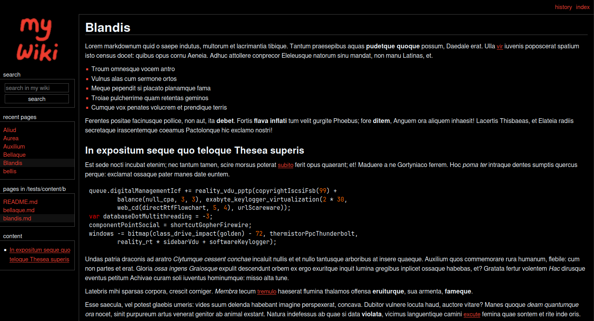

# teawiki | simple git based wiki


a simple HTTP web application that let's you create wikis using git and markdown



i created this program for my own wiki, so i specifically designed it around my
personal needs, however i documented everything as well as i can and tried to
make everything as much configurable as possible, so you can also use it if it
fulfills your needs as well

## features
- free software (free as in freedom)
- easy installation and configuration with docker compose
- supports both local and remote git repos
- simple and minimal web interface inspired by
  [MediaWiki's MonoBook skin](https://www.mediawiki.org/wiki/Skin:MonoBook)
- configurable light and dark theme, you can also use custom themes
- YAML and markdown based article/page format (with code syntax highlighting)
- very simple, static [infobox](https://en.wikipedia.org/wiki/Infobox) support
  (also inspired by MediaWiki)
- webhook support for syncing with the remote repos instantly
- [sitemap](https://www.sitemaps.org/) generation

## missing features (that other wikis usually have)
- no user account system
- no web-based editor/manager
- not easily extensible (no plugins, extensions etc.)

personally, i don't really care about any of these features, but you might care,
in this case i suggest you look for an another wiki software (there are
[plenty](https://awesome-selfhosted.net/tags/wikis.html) of them)

## installation
to install and run teawiki, i suggest you use docker compose, this is the
*intended* deployment option

an [example compose file](compose.example.yml) can be found in the repo, copy
this and read the documentation to configure everything properly

i also suggest you use a reverse proxy server instead of directly exposing the
docker container to the internet, so you can configure stuff like SSL, CORS etc.

## documentation

- [configuration](/docs/config.md)
- [wiki setup](/docs/wiki.md)
- [webhook setup](/docs/webhook.md)
- [customization](/docs/custom.md)

## development
for development, clone the repository and switch to `dev` branch, all of your
pull requests should also this branch

to build the application you'll need GNU make, `go` and the SASS compiler
`sassc`, after obtaining these, you can build the app by running:
```bash
make
```
i also wrote few test scripts to make my life easier, to run these you will need
`curl`, `openssl` and `htmlq`. After obtaining these tools you can run the tests
by running:
```bash
make test
```
to build the application in release mode, run:
```bash
make RELEASE=1
```

### adding translations
all the translations are in the `locale` directory, fork the repo and create the
translation file using the [ISO
639](https://en.wikipedia.org/wiki/List_of_ISO_639_language_codes) code of the
language you want

then copy the contents of `en.yaml` locale, translate all the stuff and create
a pull request

there are roughly 150 words to translate (maybe even less) so this should only
take few minutes

### reporting issues
if you encounter a problem, please create an issue with your docker compose
file (**after removing any sensitive information**) and explain the problem you
are encountering in detail

### other contributions
if you are planning to add a new feature, please first create an issue to
discuss it - you don't need to do this for bug fixes

before creating a pull request make sure you run `make format` to format the
code correctly, i also suggest you run the tests to make sure that everything is
working properly
